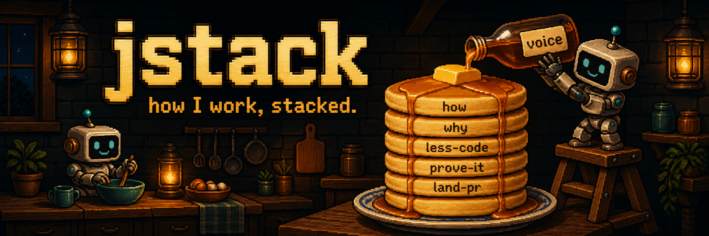

# jstack

<p align="center">
  
</p>

How I work with coding agents, written down as skills.

One flow from claiming a task to turning it in with proof. Twenty-four principles, each a single rule with a test. Sixteen workflows for the parts that need steps. A mode skill that ties it together. Every file is written to be read by an agent in Claude Code, Codex, Cursor, or anything else that loads skills from a folder.

The opinions are the point. A human stays in the merge seat. Every claim ships with evidence. The obvious solution wins over the clever one. If you don't agree with those, this isn't your stack, and that's fine.

## Install

```sh
curl -fsSL https://raw.githubusercontent.com/janiorvalle/jstack/main/install.sh | sh
```

That puts the `jstack` binary in `~/.local/bin`, checksum verified, and runs `jstack setup`. Setup finds the coding agents on the machine, shows what it would do, and asks which ones to install into. Then it copies the skills, puts the letter in each harness's instructions file, and offers to install the tools the flow needs. It never touches a skill it doesn't own, and everything it overwrites is backed up under `~/.jstack/backup/`.

Run `jstack setup` again any time. It remembers the harnesses you picked. `jstack upgrade` fetches the newest release and reruns setup.

Without a terminal, setup prints the plan and the exact flags to apply it, and changes nothing:

```sh
jstack setup --harness claude,codex --yes   # or --harness all
```

Add `--install-tools` to install the missing tools without asking, and `--update-tools` to update the outdated ones. Add `--keep-instructions` to append the letter to an instructions file that has other content instead of replacing it.

## Use it

Restart your harness so the skills load. Then start any multi-step task with `/jstack-mode`, or just say "work the jstack way". The letter is in your instructions file, so the mode is on in every session.

## Tools

The flow leans on four tools, and `jstack setup` offers each one that's missing or behind its latest release:

- **quest**, the work tracker. Claim before touching files, attach evidence at turn-in.
- **roast**, the independent review gate. A different model reviews the diff until it says well done.
- **bgr**, the review walkthrough. Its HTML is the last piece of evidence before turn-in.
- **agent-browser**, a real browser from the command line, for using what you built like a person would.

Each tool ships its own skill and installs it. `tools.md` has the check, version, and install lines setup runs.

## What's in it

- `AGENTS.md` is the letter. Who's who, what we're doing, and the two or three rules that matter before you've read anything else. Setup installs it into your harness's user-level instructions file so the mode is always on.
- `skills/jstack-mode/` is the front door. The flow, the rules, and an index of every skill, generated from their description lines.
- `skills/*/` with `kind: principle` in the frontmatter are the principles. One rule each.
- The rest are workflows. `how`, `why`, `architect`, `arena`, `swarm`, `land-pr`, `worktree`, and so on.
- `tools.md` names the tools the flow expects to find installed and how to get them. The agent-browser install line pins the CLI version, because its skill text ships inside the CLI; `scripts/tool-bump.py` and the same weekly workflow move that pin through a PR.
- `vendor.json` pins the third-party skills that live in `skills/`. A skill lives in this repo when jstack doesn't control the tool that owns it, so a change to the skill text goes through a reviewed PR. `scripts/vendor-bump.py` copies each one in at its pinned commit, and a weekly workflow opens a bump PR when upstream moves. Our own tools (quest, roast, bgr, tokenomnom) keep shipping their skill with the binary.
- `cmd/jstack` and `internal/` are the binary. The skills, the letter, `tools.md`, and `vendor.json` are embedded at build time, so setup runs from anywhere.
- `decisions.md` is the record of choices made while building this, so nobody relitigates them.

## Development

```sh
make install-hooks   # gitleaks plus the verify script on every commit
make verify          # what CI runs: gofmt, build, vet, test, then the skill checks
make index           # rebuild the letter's workflows table after changing a description
make setup           # go run ./cmd/jstack setup, with this checkout's skills embedded
```

See `CONTRIBUTING.md` for the shape of a skill and the CLA.

## Credit

The idea of a personal agent stack with a mode as the front door, small principle files, and a fan-out pattern for understanding code was inspired by [pstack](https://github.com/cursor/plugins/tree/main/pstack). Everything here is written from scratch.

## License

MIT.
